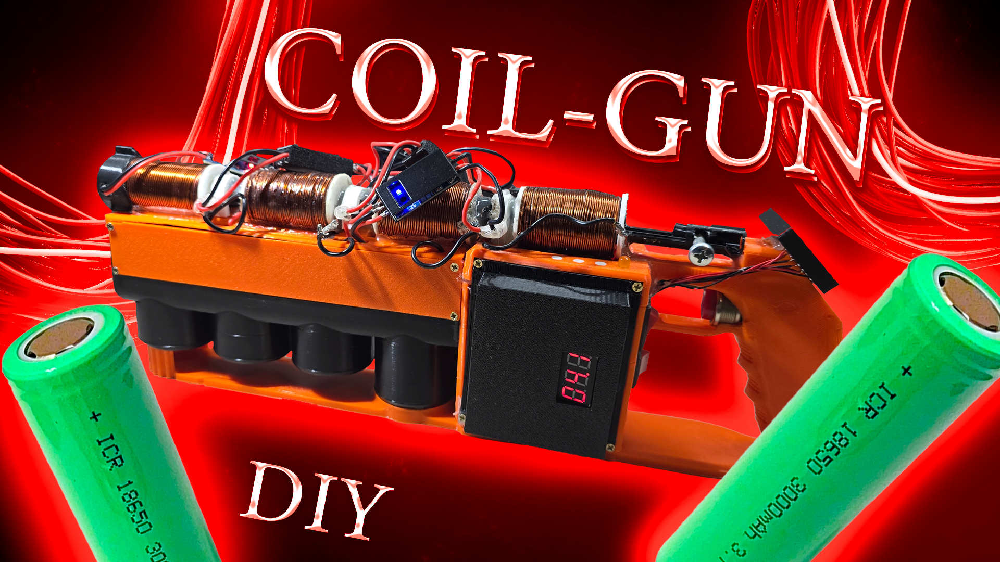
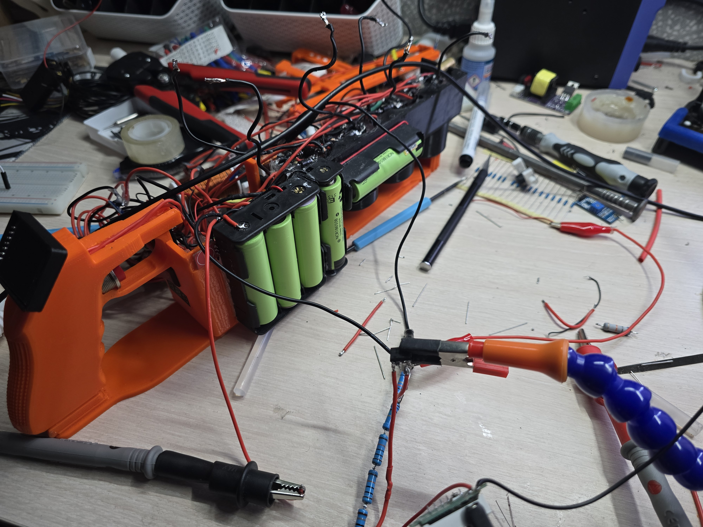
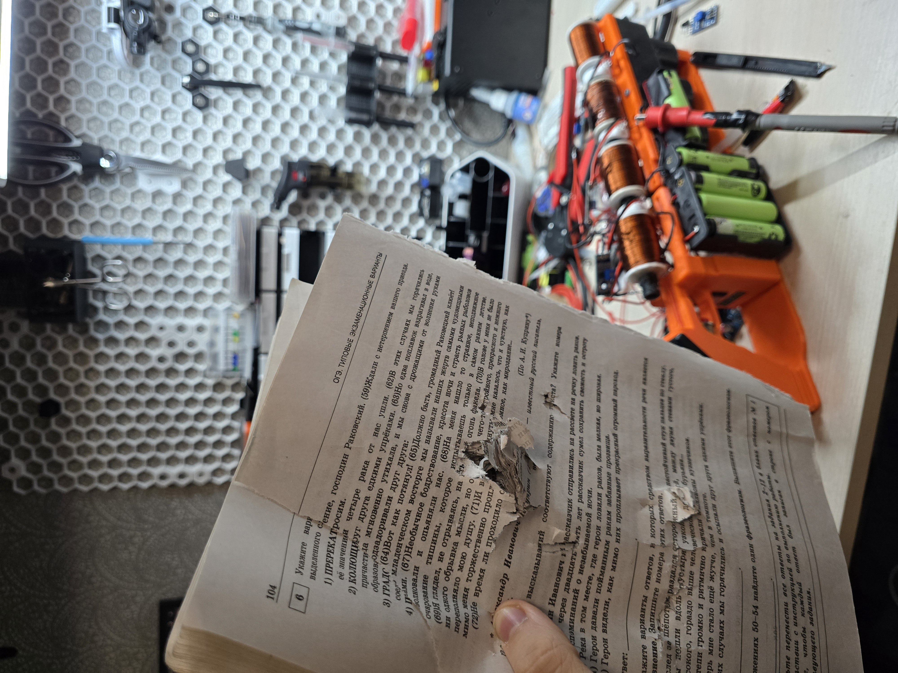

# Four-Stage Electromagnetic Mass Accelerator

## Overview
This project presents the design, simulation, construction, and experimental study of a four-stage electromagnetic mass accelerator (coilgun). The system was developed as an independent high school research project focused on optimizing the timing synchronization between acceleration stages.

The accelerator uses sequential activation of electromagnetic coils to accelerate a ferromagnetic projectile, with control implemented via a microcontroller and position sensors.

## Video
Watch the full project video here:

https://youtu.be/cELHIlVWsvM?si=opqlc6a6_jUCVKcN

## Key Features
- 4-stage electromagnetic acceleration system
- Microcontroller-based control (ESP32)
- Infrared position sensing system
- High-voltage capacitor discharge stages
- Numerical simulation (FEMM) + experimental validation
- Fully designed mechanical structure (3D CAD + 3D printing)

## What I Did
- Designed and built a working four-stage electromagnetic accelerator
- Performed analytical calculations of system parameters
- Developed FEMM simulation models for magnetic field and force analysis
- Designed the electronic control system (ESP32 + sensors + power electronics)
- Created full 3D CAD model of the device
- Conducted experimental testing and data collection
- Analyzed efficiency and compared simulation with real results
- Wrote a full research paper (24 pages)

## Design
The device consists of four electromagnetic coils powered by individual capacitors (1000 µF, up to 420 V each). The system is controlled by an ESP32 microcontroller, which receives signals from infrared sensors detecting projectile position.

Each stage is triggered based on projectile position, allowing dynamic synchronization of coil activation.

The structure is built in a compact 3D-printed case (PETG), with total length ~37 cm.

## Results
- Final projectile velocity: ~36.5 m/s
- Projectile mass: 11 g
- Kinetic energy: ~7.3 J
- Total stored energy: ~352 J
- System efficiency: ~2.1%

The system demonstrated stable multi-stage acceleration and clear dependence of efficiency on timing synchronization.

## Research Focus
The main goal of this project was to investigate how the timing delay between projectile detection and coil activation affects system efficiency.

It was found that even small changes in sensor position significantly affect performance, confirming high sensitivity of multi-stage electromagnetic accelerators to synchronization parameters.

## Media

### Build Process

### Tests

## Files
- `schematics/` — electrical diagrams and system architecture
- `cad/` — CAD renders
- `media/` — photos and videos of the device and experiments

## Safety Notice
This repository is provided for documentation purposes only. I do not encourage or endorse replication of this project. Any attempt to reproduce or use the information presented here is done entirely at the user's own risk and responsibility. Users must comply with all applicable laws and safety regulations.

This project is licensed under the CC BY-NC-ND 4.0 License.
